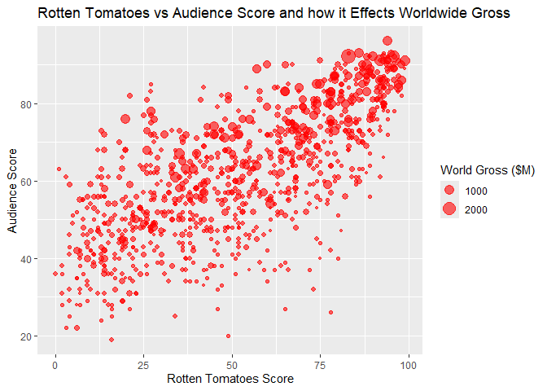
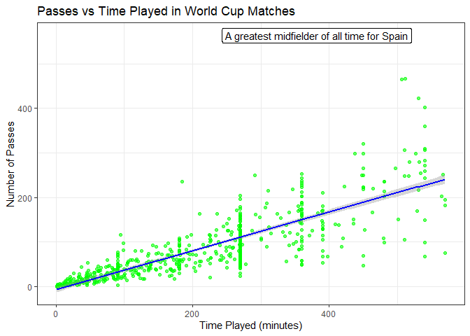
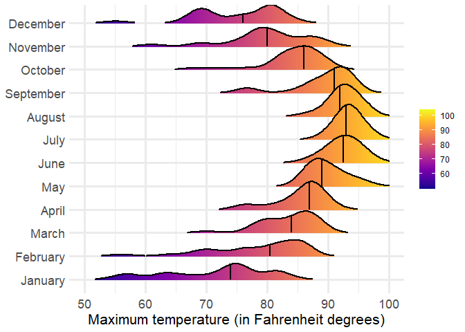

# Data Visualization and Reproducible Research

> Elisha Staudenmaier. 

The following is a sample of products created during the _"Data Visualization and Reproducible Research"_ course.

## Project 01

In the `project_01/` folder you can find an analysis of a data set containing information on movies. I wanted to explore how the success of a movie 
during its opening weekend is affected by the various conditions that a movie can face during that time frame. The main three effects that I was 
based off of critic and audience scores of the movie, the number of theaters on opening weekend, and the genre of the movie. With those three 
effects I made three different plots. You can see a full report on those in the project 1 folder. For this project my favorite plot that I created was titled 
Rotten Tomato versus Audience Score and How it Affects Worldwide Gross. I thought it was really interesting to see how each of these affected the 
movies profitability and that audience score actually served a greater effect than credit scores.

**Sample data visualization:** 

## Project 02

In this project, I explored Three different data sets. I had a hard time deciding on one data set to analyze for this project and so instead, with 
permission, I analyzed three different ones. The first one I analyzed was about cereal. I made a quick comparison of if sugar affected the calorie of 
different name branded cereals and put this in an interactive plot. From there I decided that a funny little pun would be interesting, and I chose to 
analyze the data set titled murders. This made the pun “cereal murders.”  In this data set I showed the murder rate on a map of the United States. I 
plan on moving and I thought this would be a good way of showing what would safe areas to live would be. For the third plot I analyzed a data set 
that had World Cup statistics. I enjoy soccer and like team players, so I did a plot that analyzed playtime with the number of passes that a player 
made in that time. This was my favorite plot and can be seen below. Find the code and report in the `project_02/` folder.

**Sample data visualization:** 

## Project 03

In this project, I explored reproducibility of plots. We were given the data for Tampa weather images of plots that we had to recreate. This was a 
little difficult getting the exact details of each plot and I'm sure I messed up a little bit on some of them. But ultimately I feel like I was able to 
succeed in my attempts. At the very end of this project we had to analyze a file of just text and provide a graphic for that and for that I decided to 
analyze the sentiment of song lyrics in 2015. It was surprisingly negative. But that being said my favorite plot was actually from part D as it was a 
plot that I had never used before and I thought it was interesting to create and see how it compared datasets of different months. You can find the 
code in the `project_02/` folder.

**Sample data visualization:** 

### Moving Forward

This class did provide me with a great environment to learn basic R in a quick amount of time. I did learn a lot more about creating different plots 
and the manner of which makes them better plots for displaying data in a way that readers will understand. I plan on continuing to mess around 
and learning a little bit of R in my free time to make more use of this program and there is a possibility it might show up in what I want to do for a 
career when I have to present information to design companies.  I don't know what the future holds but if it does hold more of R, I feel better 
prepared for it.