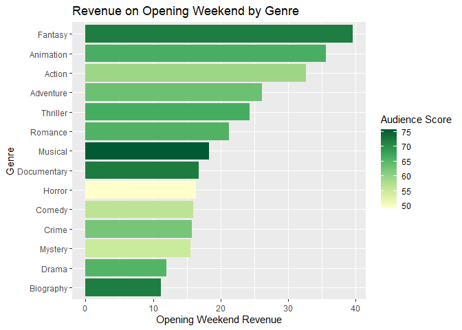
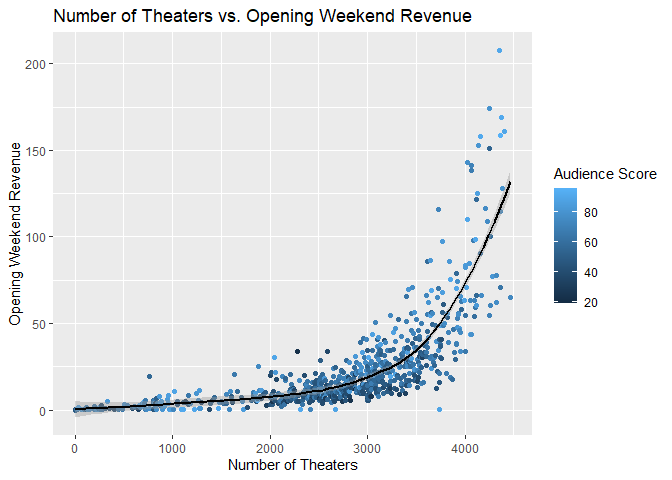

# Data Visualization Project 01

## **Description**

I'd like to consider myself someone who enjoys movies; so for this project I found a data set that covers data on movies.  It's called HollywoodMovies. It covers years 2007 to 2013 and it covers the following data categories: 

- movie
- lead studio
- Rotten Tomatoes score
- audience score
- story
- genre
- number of theaters in opening week
- box office average opening weekend
- domestic gross
- foreign gross
- world gross
- budget
- profitability
- opening profit

The main reason I chose this data set is I thought it would be interesting to see how well movies performed in a meaningful way.For this analysis I focused on genre, opening weekend revenue, audience score, Rotten Tomatoes score, world gross, and number of theaters open opening week. By using a combination of these six I felt I was able to create 3 visualizations to provide insight behind the scenes of movies.

**Set up libraries, Call the data and display data.**

``` r
library(tidyverse)
```

```
## ── Attaching core tidyverse packages ──────────────────────── tidyverse 2.0.0 ──
## ✔ dplyr     1.1.4     ✔ readr     2.1.5
## ✔ forcats   1.0.0     ✔ stringr   1.5.1
## ✔ ggplot2   3.5.2     ✔ tibble    3.2.1
## ✔ lubridate 1.9.4     ✔ tidyr     1.3.1
## ✔ purrr     1.0.4     
## ── Conflicts ────────────────────────────────────────── tidyverse_conflicts() ──
## ✖ dplyr::filter() masks stats::filter()
## ✖ dplyr::lag()    masks stats::lag()
## ℹ Use the conflicted package (<http://conflicted.r-lib.org/>) to force all conflicts to become errors
```

``` r
movies <- read_csv("https://raw.githubusercontent.com/aalhamadani/datasets/main/HollywoodMovies.csv")
```

```
## Rows: 970 Columns: 16
## ── Column specification ────────────────────────────────────────────────────────
## Delimiter: ","
## chr  (4): Movie, LeadStudio, Story, Genre
## dbl (12): RottenTomatoes, AudienceScore, TheatersOpenWeek, OpeningWeekend, B...
## 
## ℹ Use `spec()` to retrieve the full column specification for this data.
## ℹ Specify the column types or set `show_col_types = FALSE` to quiet this message.
```

``` r
movies
```

```
## # A tibble: 970 × 16
##    Movie    LeadStudio RottenTomatoes AudienceScore Story Genre TheatersOpenWeek
##    <chr>    <chr>               <dbl>         <dbl> <chr> <chr>            <dbl>
##  1 Spider-… Sony                   61            54 Meta… Acti…             4252
##  2 Shrek t… Paramount              42            57 Quest Anim…             4122
##  3 Transfo… Paramount              57            89 Mons… Acti…             4011
##  4 Pirates… Disney                 45            74 Resc… Acti…             4362
##  5 Harry P… Warner Br…             78            82 Quest Adve…             4285
##  6 I Am Le… Warner Br…             69            69 Quest Thri…             3606
##  7 The Bou… Universal              93            91 Purs… Thri…             3660
##  8 Nationa… Disney                 31            72 The … Thri…             3832
##  9 Alvin a… Fox                    26            73 Come… Anim…             3475
## 10 300      Warner Br…             60            90 Sacr… Acti…             3103
## # ℹ 960 more rows
## # ℹ 9 more variables: OpeningWeekend <dbl>, BOAvgOpenWeekend <dbl>,
## #   DomesticGross <dbl>, ForeignGross <dbl>, WorldGross <dbl>, Budget <dbl>,
## #   Profitability <dbl>, OpenProfit <dbl>, Year <dbl>
```
<div style="font-size: 8px;">⠀</div>

### **Plan, Set-up and Result  Analyzation**

For this project I decided I was going to make use of scatter plots and bar charts. And because I had a very large data set, I needed to filter the data set down for each plot into the relevant information.

**Filter data down to genre, OpeningWeekend, AudienceScore**

``` r
movie_typ <- movies %>%
  filter(!is.na(Genre)) %>%
  filter(!is.na(OpeningWeekend)) %>%
  filter(!is.na(AudienceScore)) %>%
  group_by(Genre) %>%
  summarize(avg_income = mean(OpeningWeekend),
            avg_view_score =  mean(AudienceScore))

movie_typ
```

```
## # A tibble: 14 × 3
##    Genre       avg_income avg_view_score
##    <chr>            <dbl>          <dbl>
##  1 Action            32.6           59.3
##  2 Adventure         26.1           63.5
##  3 Animation         35.6           66.3
##  4 Biography         11.2           72  
##  5 Comedy            16.0           56.4
##  6 Crime             15.7           62.5
##  7 Documentary       16.7           72.2
##  8 Drama             12.0           65.4
##  9 Fantasy           39.5           72  
## 10 Horror            16.4           49.1
## 11 Musical           18.3           75.8
## 12 Mystery           15.6           55  
## 13 Romance           21.3           65.7
## 14 Thriller          24.3           66.5
```
<div style="font-size: 8px;">⠀</div>
**Opening Weekend Revenue based off of Genre and how the Audience Scored them plot**

My first plot I decided that I wanted to analyze how are the different genres of movies performed in their opening weekend revenue take. To add some more information, I mixed in audience score as a gradient to see on average how each of the genres performed. I decided the best way to do this was with a bar chart. Specifically, a column bar chart. Along the X axis is the opening weekend revenue and on the Y axis it is organized by genre reordered into the highest performing genre type to the lowest genre type. I decided to get some more information from this by adding the audience score as a gradient so that the lower performing genre types would be shown in a lighter yellow, while the highest performing genre types would be a dark green. Not only did this show what genres typically performed better in their opening weekend but it also showed that on average what genres perform better with audiences. I was very surprised to see that horror as a genre has a low average, and musicals have a high one.


``` r
ggplot(data = movie_typ,
       mapping = aes(x = avg_income, 
                     y = reorder(Genre, avg_income),
                     fill = avg_view_score)) +
  geom_col() +
  scale_fill_distiller(palette = "YlGn", direction = 1) +
  labs(title = "Revenue on Opening Weekend by Genre",
       x = "Opening Weekend Revenue",
       y = "Genre",
       fill = "Audience Score")
```

<!-- -->
<div style="font-size: 8px;">⠀</div>
**Filter data down to RottenTomatoes, AudienceScore, WorldGross**

``` r
movie_score <- movies %>%
  filter(!is.na(RottenTomatoes)) %>%
  filter(!is.na(AudienceScore)) %>%
  filter(!is.na(WorldGross))

movie_score
```

```
## # A tibble: 906 × 16
##    Movie    LeadStudio RottenTomatoes AudienceScore Story Genre TheatersOpenWeek
##    <chr>    <chr>               <dbl>         <dbl> <chr> <chr>            <dbl>
##  1 Spider-… Sony                   61            54 Meta… Acti…             4252
##  2 Shrek t… Paramount              42            57 Quest Anim…             4122
##  3 Transfo… Paramount              57            89 Mons… Acti…             4011
##  4 Pirates… Disney                 45            74 Resc… Acti…             4362
##  5 Harry P… Warner Br…             78            82 Quest Adve…             4285
##  6 I Am Le… Warner Br…             69            69 Quest Thri…             3606
##  7 The Bou… Universal              93            91 Purs… Thri…             3660
##  8 Nationa… Disney                 31            72 The … Thri…             3832
##  9 Alvin a… Fox                    26            73 Come… Anim…             3475
## 10 300      Warner Br…             60            90 Sacr… Acti…             3103
## # ℹ 896 more rows
## # ℹ 9 more variables: OpeningWeekend <dbl>, BOAvgOpenWeekend <dbl>,
## #   DomesticGross <dbl>, ForeignGross <dbl>, WorldGross <dbl>, Budget <dbl>,
## #   Profitability <dbl>, OpenProfit <dbl>, Year <dbl>
```
<div style="font-size: 8px;">⠀</div>
**Rotten Tomatoes vs Audience Score and how it Effects Worldwide Gross plot**

For my second plot I decided that I wanted to focus on how audience scores and critics scores affected how the movie performed. For this I made the plot a scatter plot with the Rotten Tomatoes scores along the X and the audience scores along the Y. This showed that science scores and rotten tomato scores aren't typically in agreement with each other. I was surprised to see that the Rotten Tomatoes score had a wider range of scores than the audience score. By adding in world gross under the size identifier, we could see large groupings of where lower and higher performing movies were grouped based off of their audience scores and Rotten Tomatoes scores. At first glance, with a couple of outliers, generally the better performing movies would have the audience and the Rotten Tomatoes scorers in agreement as higher scores. But on closer inspection you could see that movies generally performed better and had a higher world gross when the audience score was higher and not necessarily having a higher rotten tomato score. To me this showed that the performance of a movie is up to the audience and not the critics.


``` r
ggplot(data = movie_score, 
       mapping = aes(x = RottenTomatoes, 
                     y = AudienceScore, 
                     size = WorldGross)) +
  geom_point(alpha = 0.6, color = "red") +
  labs(title = "Rotten Tomatoes vs Audience Score and how it Effects Worldwide Gross",
       x = "Rotten Tomatoes Score",
       y = "Audience Score",
       size = "World Gross ($M)")  # Updated label to match correct variable name
```

<!-- -->
<div style="font-size: 8px;">⠀</div>
**Filter data down to TheatersOpenWeek, OpeningWeekend, AudienceScore**

``` r
movie_profit <- movies %>%
  filter(!is.na(TheatersOpenWeek)) %>%
  filter(!is.na(OpeningWeekend)) %>%
  filter(!is.na(AudienceScore)) %>%
  group_by(TheatersOpenWeek) %>%
  summarize(avg_income = mean(OpeningWeekend),
            avg_view_score =  mean(AudienceScore))

movie_profit
```

```
## # A tibble: 751 × 3
##    TheatersOpenWeek avg_income avg_view_score
##               <dbl>      <dbl>          <dbl>
##  1                1      0.01            53  
##  2                2      0.032           77  
##  3                3      0.11            40  
##  4                4      0.216           70.8
##  5                5      0.433           73  
##  6                6      0.162           42  
##  7                9      0.275           62  
##  8               10      0.34            80  
##  9               11      0.522           72  
## 10               15      0.22            73  
## # ℹ 741 more rows
```
<div style="font-size: 8px;">⠀</div>
**Number of Theaters vs. Opening Weekend Revenue with added affect of Audience Score plot**

My last plot I wanted to see how the number of theaters played a role in the movie’s success. I again used a scatter plot. Along the X axis I have the number of theaters during the opening week and on the Y axis I had the opening weekend revenue. I added the gradient of audience scores to C if there was a direct correlation between number of theaters and audience opinion. In this plot you can see that as soon as we start heading past 3000 theaters for the opening week it starts to grow exponentially with how much revenue is generated for that opening weekend. What is surprising is that the average audience score is not really affected by this. We can see an even distribution of audience scores throughout the entirety of the plot. This shows that while the number of theaters does affect potential revenue it does not completely affect the average audience’s opinion.


``` r
ggplot(data = movie_profit, 
       mapping = aes(x = TheatersOpenWeek, 
                     y = avg_income,
                     color = avg_view_score)) +
  geom_point() +
  geom_smooth(color = "black") +
  labs(title = "Number of Theaters vs. Opening Weekend Revenue",
       x = "Number of Theaters",
       y = "Opening Weekend Revenue",
       color = "Audience Score")
```

```
## `geom_smooth()` using method = 'loess' and formula = 'y ~ x'
```

<!-- -->

#### **Potential story**

I believe that with my 3 plots, you could tell the story of how and movies performance is dependent on its genre type, number of theaters in its opening week and its reviews, but specifically its audience score reviews. With these three plots you can see that while each of these have an effect it is the audience score that has a greater effect on how well a movie does. If a movie doesn't connect with its audience, it's probably not going to perform well.

#### **Principles of Data Visualizations**

I believe I was able to use the principles of data visualization by applying what we learned in class. I didn't try to overcomplicate what I was analyzing and broke it down into logical groupings. I did make use of color in a way that also made it represent some data in a non over stimulating way. Every piece of information on my plots had a purpose without taking away from other parts of the plots. I believe I was able to get my chosen information across in a visually pleasing and informative matter.
