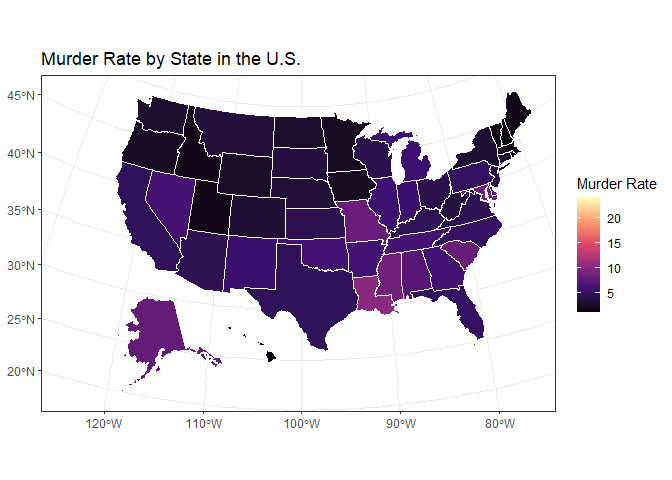
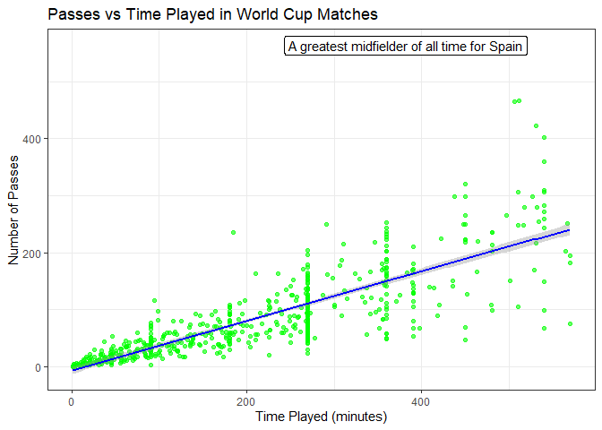

# Data Visualization Project 02

## **Introducrtion**

  For this project I had a difficult time choosing a data set that would allow me to do all three plots at once. Instead, I followed a different approach and decided to choose three different datasets to create each plot so that I would be able to explore the ability of creating a story for each type of plot and data set. The datasets chose to analyze where titled cereal, murders and soccer. The reason behind these picks was that I thought that the first two made a funny pun on the name serial murders, and I enjoy soccer. 

  Below is the section of code that calls upon the different libraries I attempted to use and the three different datasets being called from their website pages.


``` r
library(tidyverse)
library(plotly)
library(ggplot2)
library(usmap)
library(ggrepel)


cereal <- read_csv("https://raw.githubusercontent.com/aalhamadani/datasets/main/Cereals.csv")
murders <- read_csv("https://raw.githubusercontent.com/aalhamadani/datasets/main/murders_raw.csv")
soccer <- read_csv("https://raw.githubusercontent.com/aalhamadani/datasets/main/worldcup.csv")
```

#### **Plot 1**
  
  Let's start with the plot that analyzes a data set cald "cereal".  This data set contains many nutritional facts with various brands of cereals.  For my analysis I decided to make an interactive scatter plot that compared each cereals sugar content to its calories. Luckily none of the data was always missing in these categories so I didn't have to clean up anything. I chose a scatter plot because I wanted to see if there was a direct correlation between high levels of sugar with high calorie count in breakfast cereals. I have sugar plotted along the X and a calorie plotted along the Y. As you hover over each point it will give you the sugar content, calories and brand name of each cereal. Looking at the data there does seem to be a small trend with as sugar increases calories will also increase from just visual inspection it seems like there is more of a hard line that most cereals will have calories of around 110 to 120 on average. I found this very surprising as I thought it would be a more drastic increase in calories as sugar increased. I feel like this plot could be applied to a research survey about health concerns in breakfast foods and an investigation into how breakfast may be the most important meal but can be one of the unhealthiest ones.  I believe that this plot follows the principles of data visualization by keeping it nice and clean and simple and allowing people to understand what's happening at a first glance or a movement of the mouse. Below you can see the created plot.


``` r
p <- ggplot(data = cereal, 
            mapping = aes(x = sugars,
                          y = calories,
                          text = name)) +
  geom_point(color = "red",
             size = 2) +
  labs(title = "Sugar vs Calories in Cereals",
       x = "Sugar (grams)",
       y = "Calories") +
  theme_bw()

interact <- ggplotly(p)
interact
```

```{=html}
<div class="plotly html-widget html-fill-item" id="htmlwidget-5b990fac13b98efc27de" style="width:672px;height:480px;"></div>
<script type="application/json" data-for="htmlwidget-5b990fac13b98efc27de">{"x":{"data":[{"x":[6,8,5,0,8,10,14,8,6,5,12,1,9,7,13,3,2,12,13,7,0,3,10,5,13,11,7,10,12,12,15,9,5,3,4,11,10,11,6,9,3,6,12,3,11,11,13,6,9,7,2,10,14,3,0,0,6,null,12,8,6,2,3,0,0,0,15,3,5,3,14,3,3,12,3,3,8],"y":[70,120,70,50,110,110,110,130,90,90,120,110,120,110,110,110,100,110,110,110,100,110,100,100,110,110,100,120,120,110,100,110,100,110,120,120,110,110,110,140,110,100,110,100,150,150,160,100,120,140,90,130,120,100,50,50,100,100,120,100,90,110,110,80,90,90,110,110,90,110,140,100,110,110,100,100,110],"text":["sugars:  6<br />calories:  70<br />100%_Bran","sugars:  8<br />calories: 120<br />100%_Natural_Bran","sugars:  5<br />calories:  70<br />All-Bran","sugars:  0<br />calories:  50<br />All-Bran_with_Extra_Fiber","sugars:  8<br />calories: 110<br />Almond_Delight","sugars: 10<br />calories: 110<br />Apple_Cinnamon_Cheerios","sugars: 14<br />calories: 110<br />Apple_Jacks","sugars:  8<br />calories: 130<br />Basic_4","sugars:  6<br />calories:  90<br />Bran_Chex","sugars:  5<br />calories:  90<br />Bran_Flakes","sugars: 12<br />calories: 120<br />Cap'n'Crunch","sugars:  1<br />calories: 110<br />Cheerios","sugars:  9<br />calories: 120<br />Cinnamon_Toast_Crunch","sugars:  7<br />calories: 110<br />Clusters","sugars: 13<br />calories: 110<br />Cocoa_Puffs","sugars:  3<br />calories: 110<br />Corn_Chex","sugars:  2<br />calories: 100<br />Corn_Flakes","sugars: 12<br />calories: 110<br />Corn_Pops","sugars: 13<br />calories: 110<br />Count_Chocula","sugars:  7<br />calories: 110<br />Cracklin'_Oat_Bran","sugars:  0<br />calories: 100<br />Cream_of_Wheat_(Quick)","sugars:  3<br />calories: 110<br />Crispix","sugars: 10<br />calories: 100<br />Crispy_Wheat_&_Raisins","sugars:  5<br />calories: 100<br />Double_Chex","sugars: 13<br />calories: 110<br />Froot_Loops","sugars: 11<br />calories: 110<br />Frosted_Flakes","sugars:  7<br />calories: 100<br />Frosted_Mini-Wheats","sugars: 10<br />calories: 120<br />Fruit_&_Fibre_Dates,_Walnuts,_and_Oats","sugars: 12<br />calories: 120<br />Fruitful_Bran","sugars: 12<br />calories: 110<br />Fruity_Pebbles","sugars: 15<br />calories: 100<br />Golden_Crisp","sugars:  9<br />calories: 110<br />Golden_Grahams","sugars:  5<br />calories: 100<br />Grape_Nuts_Flakes","sugars:  3<br />calories: 110<br />Grape-Nuts","sugars:  4<br />calories: 120<br />Great_Grains_Pecan","sugars: 11<br />calories: 120<br />Honey_Graham_Ohs","sugars: 10<br />calories: 110<br />Honey_Nut_Cheerios","sugars: 11<br />calories: 110<br />Honey-comb","sugars:  6<br />calories: 110<br />Just_Right_Crunchy__Nuggets","sugars:  9<br />calories: 140<br />Just_Right_Fruit_&_Nut","sugars:  3<br />calories: 110<br />Kix","sugars:  6<br />calories: 100<br />Life","sugars: 12<br />calories: 110<br />Lucky_Charms","sugars:  3<br />calories: 100<br />Maypo","sugars: 11<br />calories: 150<br />Muesli_Raisins,_Dates,_&_Almonds","sugars: 11<br />calories: 150<br />Muesli_Raisins,_Peaches,_&_Pecans","sugars: 13<br />calories: 160<br />Mueslix_Crispy_Blend","sugars:  6<br />calories: 100<br />Multi-Grain_Cheerios","sugars:  9<br />calories: 120<br />Nut&Honey_Crunch","sugars:  7<br />calories: 140<br />Nutri-Grain_Almond-Raisin","sugars:  2<br />calories:  90<br />Nutri-grain_Wheat","sugars: 10<br />calories: 130<br />Oatmeal_Raisin_Crisp","sugars: 14<br />calories: 120<br />Post_Nat._Raisin_Bran","sugars:  3<br />calories: 100<br />Product_19","sugars:  0<br />calories:  50<br />Puffed_Rice","sugars:  0<br />calories:  50<br />Puffed_Wheat","sugars:  6<br />calories: 100<br />Quaker_Oat_Squares","sugars: NA<br />calories: 100<br />Quaker_Oatmeal","sugars: 12<br />calories: 120<br />Raisin_Bran","sugars:  8<br />calories: 100<br />Raisin_Nut_Bran","sugars:  6<br />calories:  90<br />Raisin_Squares","sugars:  2<br />calories: 110<br />Rice_Chex","sugars:  3<br />calories: 110<br />Rice_Krispies","sugars:  0<br />calories:  80<br />Shredded_Wheat","sugars:  0<br />calories:  90<br />Shredded_Wheat_'n'Bran","sugars:  0<br />calories:  90<br />Shredded_Wheat_spoon_size","sugars: 15<br />calories: 110<br />Smacks","sugars:  3<br />calories: 110<br />Special_K","sugars:  5<br />calories:  90<br />Strawberry_Fruit_Wheats","sugars:  3<br />calories: 110<br />Total_Corn_Flakes","sugars: 14<br />calories: 140<br />Total_Raisin_Bran","sugars:  3<br />calories: 100<br />Total_Whole_Grain","sugars:  3<br />calories: 110<br />Triples","sugars: 12<br />calories: 110<br />Trix","sugars:  3<br />calories: 100<br />Wheat_Chex","sugars:  3<br />calories: 100<br />Wheaties","sugars:  8<br />calories: 110<br />Wheaties_Honey_Gold"],"type":"scatter","mode":"markers","marker":{"autocolorscale":false,"color":"rgba(255,0,0,1)","opacity":1,"size":7.559055118110237,"symbol":"circle","line":{"width":1.8897637795275593,"color":"rgba(255,0,0,1)"}},"hoveron":"points","showlegend":false,"xaxis":"x","yaxis":"y","hoverinfo":"text","frame":null}],"layout":{"margin":{"t":43.762557077625573,"r":7.3059360730593621,"b":40.182648401826491,"l":43.105022831050235},"plot_bgcolor":"rgba(255,255,255,1)","paper_bgcolor":"rgba(255,255,255,1)","font":{"color":"rgba(0,0,0,1)","family":"","size":14.611872146118724},"title":{"text":"Sugar vs Calories in Cereals","font":{"color":"rgba(0,0,0,1)","family":"","size":17.534246575342465},"x":0,"xref":"paper"},"xaxis":{"domain":[0,1],"automargin":true,"type":"linear","autorange":false,"range":[-0.75,15.75],"tickmode":"array","ticktext":["0","5","10","15"],"tickvals":[0,5,10,15],"categoryorder":"array","categoryarray":["0","5","10","15"],"nticks":null,"ticks":"outside","tickcolor":"rgba(51,51,51,1)","ticklen":3.6529680365296811,"tickwidth":0.66417600664176002,"showticklabels":true,"tickfont":{"color":"rgba(77,77,77,1)","family":"","size":11.68949771689498},"tickangle":-0,"showline":false,"linecolor":null,"linewidth":0,"showgrid":true,"gridcolor":"rgba(235,235,235,1)","gridwidth":0.66417600664176002,"zeroline":false,"anchor":"y","title":{"text":"Sugar (grams)","font":{"color":"rgba(0,0,0,1)","family":"","size":14.611872146118724}},"hoverformat":".2f"},"yaxis":{"domain":[0,1],"automargin":true,"type":"linear","autorange":false,"range":[44.5,165.5],"tickmode":"array","ticktext":["80","120","160"],"tickvals":[80,120,160],"categoryorder":"array","categoryarray":["80","120","160"],"nticks":null,"ticks":"outside","tickcolor":"rgba(51,51,51,1)","ticklen":3.6529680365296811,"tickwidth":0.66417600664176002,"showticklabels":true,"tickfont":{"color":"rgba(77,77,77,1)","family":"","size":11.68949771689498},"tickangle":-0,"showline":false,"linecolor":null,"linewidth":0,"showgrid":true,"gridcolor":"rgba(235,235,235,1)","gridwidth":0.66417600664176002,"zeroline":false,"anchor":"x","title":{"text":"Calories","font":{"color":"rgba(0,0,0,1)","family":"","size":14.611872146118724}},"hoverformat":".2f"},"shapes":[{"type":"rect","fillcolor":"transparent","line":{"color":"rgba(51,51,51,1)","width":0.66417600664176002,"linetype":"solid"},"yref":"paper","xref":"paper","x0":0,"x1":1,"y0":0,"y1":1}],"showlegend":false,"legend":{"bgcolor":"rgba(255,255,255,1)","bordercolor":"transparent","borderwidth":1.8897637795275593,"font":{"color":"rgba(0,0,0,1)","family":"","size":11.68949771689498}},"hovermode":"closest","barmode":"relative"},"config":{"doubleClick":"reset","modeBarButtonsToAdd":["hoverclosest","hovercompare"],"showSendToCloud":false},"source":"A","attrs":{"6f546d496c2e":{"x":{},"y":{},"text":{},"type":"scatter"}},"cur_data":"6f546d496c2e","visdat":{"6f546d496c2e":["function (y) ","x"]},"highlight":{"on":"plotly_click","persistent":false,"dynamic":false,"selectize":false,"opacityDim":0.20000000000000001,"selected":{"opacity":1},"debounce":0},"shinyEvents":["plotly_hover","plotly_click","plotly_selected","plotly_relayout","plotly_brushed","plotly_brushing","plotly_clickannotation","plotly_doubleclick","plotly_deselect","plotly_afterplot","plotly_sunburstclick"],"base_url":"https://plot.ly"},"evals":[],"jsHooks":[]}</script>
```

#### **Plot 2**
  
  The next plot I created was a spatial visualization plot. I chose to use the data set that was titled “murder” for this. I decided that from the data set I could pull the murder rates from the different states and plot them on a map to compare how each state stacked up with varying murder rates. The reason I chose this data is that I do plan to potentially move to another state to follow my career and I feel like knowing about the areas I might end up would be helpful me on that decision. I took advantage of our studios built in US map library to make plotting easier. I was able to create a map of the United States and fill each state in with its murder rate. I used a gradient in the fill to show that each state had a different rate. The data surprised me a lot in this. I was expecting states like New York Florida and California to have much higher murder rates. Surprisingly Louisiana and Alaska had some of the higher ones just to name two. When I analyze the data more closely it made sense. Something to keep in mind is that the murder rate is based off population as well. So, if you have a high amount of murder and lower population, you'll have a higher rate. This explains Alaska and surprisingly some of the smaller states. I feel like creating additional plots to explore the population versus area of each state would also help drive home this fact. It would do for an interesting study or paper on safe places to live in America. I believe this plot follows the principles of data visualization by making it clean and easy to distinguish each state as well as providing easy understanding of what is being measured here. Below you can see the created plot.


``` r
murders <- murders %>%
  mutate(state = tolower(state))

plot_usmap(data = murders, 
           values = "murder_rate", 
           color = "white") +
  scale_fill_viridis_c(option = "magma", 
                       name = "Murder Rate") +
  labs(title = "Murder Rate by State in the U.S.") +
  theme_bw()
```

<!-- -->

#### **Plot 3**

  For my last plot I decided to analyze a data set that was a little less dark than the last one. I for one enjoy soccer. So, it was only fitting that the next data set I chose was titled "World Cup". I again chose to do a scatter plot because I thought it would be the best way to show a comparison between the time played for each player versus the number of passes each player played in World Cup matches. And the data was interesting to analyze. With time played along the X axis and number of passes along the Yi was able to get a clear distinction that as time progressed the number of passes in each match increased. But you can see clear groupings of straight lines happening in the midpoints of the plot. Upon analysis these straight lines are actually when the end of quarters is happening, and the quickest timed plays are being made. The line groupings after the 4th one are all the players who typically get put in to extended games. And amongst all of these different players there was one who really stood out as an outlier. Labeled in the plot is a player who is considered to be a greatest midfielder for Spain of all time. This player was Xavi Hernández. There were a couple other outliers as well who were also star players. I really enjoyed making this graph as it showed not only who star players were but who were star players with incredible amount of teamwork abilities. I felt that this graph upheld the standards of data visualization as its very neat and precise and could be a steppingstone in a story of analyzing great soccer players. 


``` r
outlier <- soccer %>% filter(Passes == max(Passes, na.rm = TRUE))
ggplot(data = soccer, 
       mapping = aes(x = Time, 
                     y = Passes)) +
  geom_point(color = "green", 
             alpha = 0.6) +
  geom_smooth(method = "lm", 
              color = "blue") +
  geom_label_repel(data = outlier,
            aes(label = paste0("A greatest midfielder of all time for ",Team))) +
  labs(title = "Passes vs Time Played in World Cup Matches",
       x = "Time Played (minutes)",
       y = "Number of Passes") +
  theme_bw() +
  theme(legend.position = "none")
```

```
## `geom_smooth()` using formula = 'y ~ x'
```

<!-- -->
